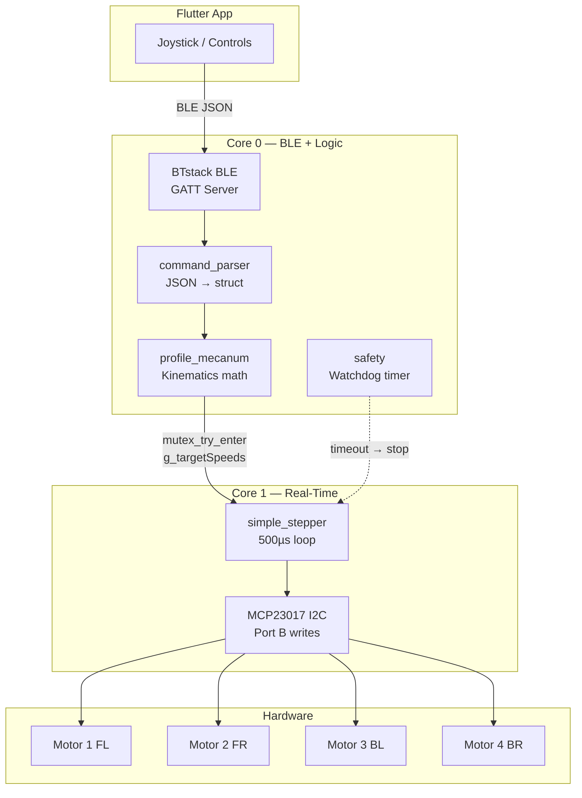
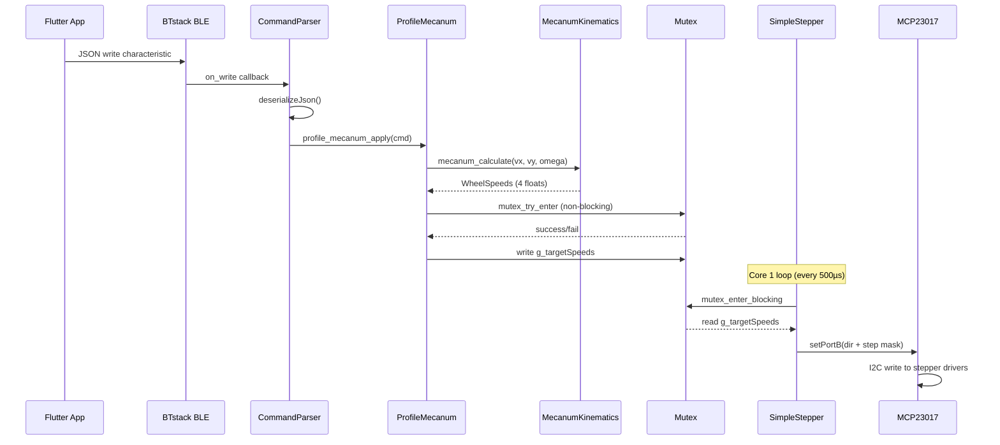
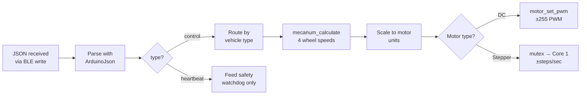
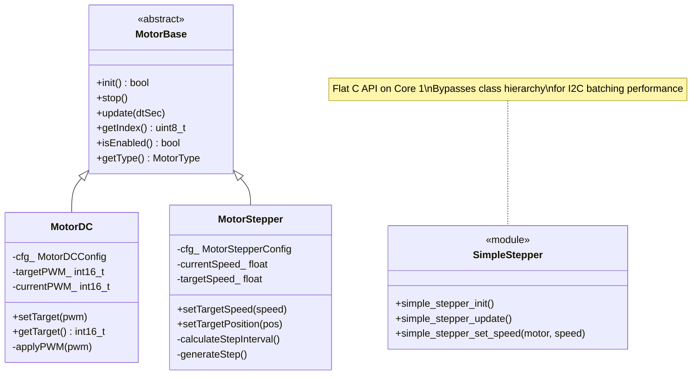

# Pico W Firmware Architecture

## Table of Contents

1. [What This Does](#what-this-does)
2. [System Architecture](#system-architecture)
3. [Data Flow](#data-flow)
4. [Command Lifecycle](#command-lifecycle)
5. [Motor Hierarchy](#motor-hierarchy)
6. [Inter-Core Communication](#inter-core-communication)
7. [Feature Comparison: Pico vs ESP32](#feature-comparison)
8. [File Structure](#file-structure)

---

## What This Does

When you push the joystick in the Flutter app, a JSON command travels over BLE to the Pico W, gets parsed into motor speeds, and — if using stepper motors — crosses from Core 0 to Core 1 via a mutex. Core 1 then generates precisely-timed step pulses through an MCP23017 I2C GPIO expander.

**The problem it solves:** The RP2040 has two cores, and we use both. Core 0 handles all the "smart" work (BLE, parsing, kinematics, safety). Core 1 handles the "fast" work (generating step pulses every 500µs). This separation ensures that BLE processing never causes stepper jitter, and stepper timing never blocks BLE.

**Why not use one core?** BTstack (the BLE stack) runs its own event loop on Core 0 and can block for several milliseconds during connection events. Stepper motors need pulses at precise intervals — even a 2ms delay causes audible rattling and missed steps.

---

## System Architecture



**Reading the diagram:**
- The app sends JSON commands over BLE to Core 0
- Core 0 parses, computes kinematics, and writes target speeds to shared memory
- Core 1 reads those speeds via mutex and generates step pulses through the MCP23017
- The safety watchdog runs on Core 0 and triggers emergency stop if no commands arrive

---

## Data Flow

This is the path of a single joystick command from finger to motor:



**Key timing:**
- BLE → motor total latency: ~20ms (dominated by BLE connection interval)
- Core 1 loop: 500µs = 2,000 updates/second
- I2C batch write: ~100µs for all 4 motors (2 writes at 400kHz)

---

## Command Lifecycle

### Vehicle Types

The Flutter app sends a `"vehicle"` field in each JSON command:

| JSON value | App Name | Left Control | Right Control |
|-----------|----------|-------------|---------------|
| `"mecanum"` | Mecanum Drive | Dial (rotation ω) | Joystick (vx, vy) |
| `"fourwheel"` | Four Wheel Drive | Dial (steering) | Slider (throttle) |
| `"tracked"` | Tracked Drive | Slider (left track) | Slider (right track) |
| `"dual"` | Dual Joystick | Joystick (left) | Joystick (right) |

### Command Processing Flow



---

## Motor Hierarchy



**Why two stepper implementations?**

| | MotorStepper (class) | simple_stepper (C module) |
|--|---|---|
| **Runs on** | Core 0 | Core 1 |
| **I2C writes** | 2 per motor (8 total) | 2 for ALL motors |
| **Features** | Trapezoidal accel, position mode | Velocity only, accumulator timing |
| **Use case** | Future position control | Real-time pulse generation |

---

## Inter-Core Communication

```
Core 0 (BLE + Logic)              Core 1 (Stepper Pulses)
┌──────────────────┐              ┌──────────────────┐
│                  │              │                  │
│  1. Compute      │              │  3. Read speeds  │
│     4 wheel      │              │     from shared  │
│     speeds       │              │     memory       │
│                  │              │                  │
│  2. Write to:    │              │  4. Generate     │
│     g_targetSpeeds[4]           │     step pulses  │
│     g_speedsUpdated             │     via MCP23017 │
│                  │              │                  │
│  Uses: mutex_    │◄────────────►│  Uses: mutex_    │
│  try_enter()     │  g_speedMutex│  enter_blocking()│
│  (non-blocking)  │              │  (blocking OK —  │
│                  │              │   Core 1 is fast)│
└──────────────────┘              └──────────────────┘
```

**Why `mutex_try_enter()` on Core 0?**

If Core 1 holds the mutex (it's mid-I2C write), Core 0 **must not block** — BTstack's event loop would stall, causing BLE timeouts. Instead, Core 0 skips the update. At 50Hz command rate, dropping one frame is imperceptible.

**Why `mutex_enter_blocking()` on Core 1?**

Core 1's loop runs every 500µs. Core 0 holds the mutex for at most ~1µs (just writing 4 floats), so the blocking wait is effectively instant.

---

## Feature Comparison

| Feature | ESP32 | Pico W | Notes |
|---------|:-----:|:------:|-------|
| BLE Control | ✅ | ✅ | ESP32 uses NimBLE; Pico uses BTstack |
| DC Motors | ✅ | ✅ | Same driver support (DRV8871, DRV8833, L298N) |
| Stepper Motors | ✅ | ✅ | Pico uses MCP23017 I2C expander |
| Mecanum Kinematics | ✅ | ✅ | Same equations, same normalization |
| Safety Watchdog | ✅ | ✅ | Same timeout pattern |
| Dual-Core | ✅ | ✅ | ESP32: FreeRTOS tasks; Pico: setup1/loop1 |
| Encoders | ✅ | ⏳ | Planned for Pico |
| PID Control | ✅ | ⏳ | Planned for Pico |
| Autotuning | ✅ | ⏳ | Planned for Pico |
| WiFi OTA | ✅ | ⏳ | Planned for Pico |
| Telemetry | ✅ | ✅ | BLE notify characteristic |

---

## File Structure

```
firmwares/pico/src/
├── main.cpp                  # Entry point: setup/loop for both cores
├── project_config.h          # ← USER SETTINGS (device name, motors, GPIO)
│
├── core/
│   ├── ble_controller.cpp/h  # BTstack BLE GATT server + MAC derivation
│   ├── ble_config.h          # UUID constants (must match ESP32 + Flutter)
│   ├── command_parser.cpp/h  # JSON → control_command_t
│   ├── command_packet.h      # Shared command struct definition
│   ├── motor_base.h          # Abstract motor interface
│   ├── motor_dc.cpp/h        # DC motor: PWM via H-bridge drivers
│   ├── motor_stepper.cpp/h   # Stepper: trapezoidal accel via MCP23017
│   ├── motor_manager.cpp/h   # Motor registry, MCP23017 init, microstepping
│   ├── safety.cpp/h          # Watchdog: stop motors on lost connection
│   └── simple_stepper.cpp/h  # Core 1 real-time stepper pulse generator
│
├── drivers/
│   ├── mcp23017.cpp/h        # MCP23017 I2C GPIO expander driver
│   └── mecanum_kinematics.cpp/h  # Inverse kinematics math
│
└── profiles/
    └── profile_mecanum.cpp/h # Joystick → kinematics → motor speeds
```

**Total: 26 files, ~3,200 lines**
