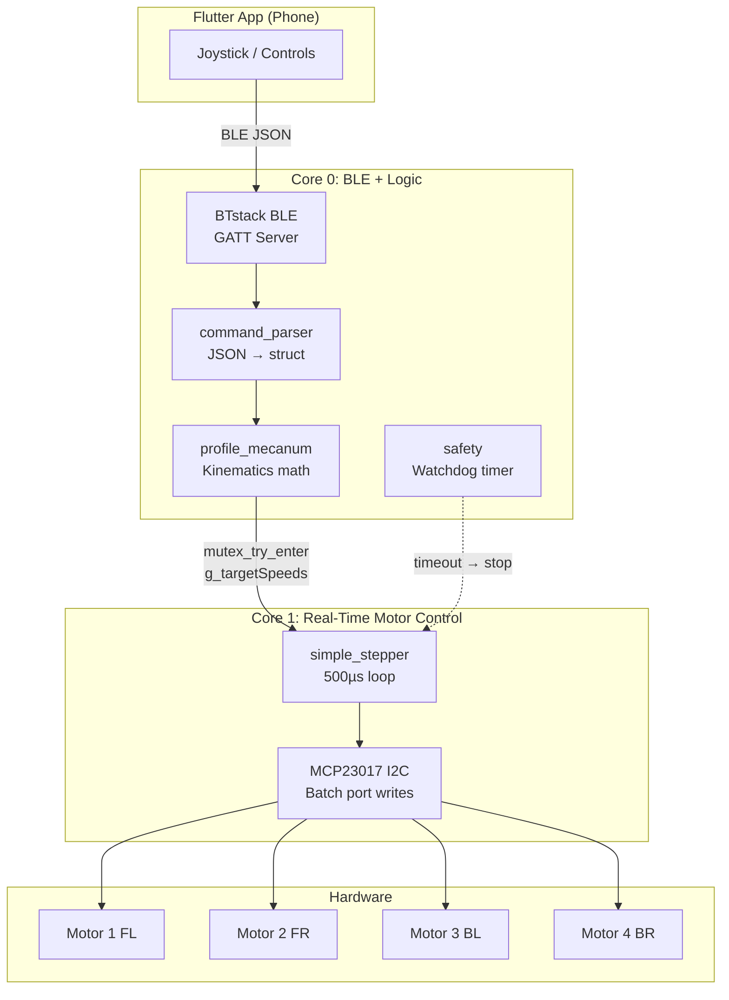
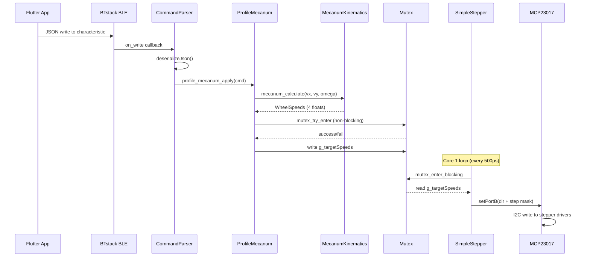
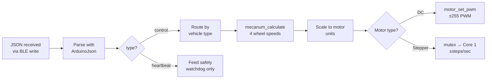
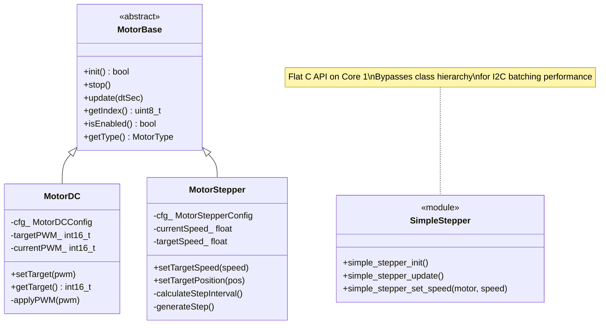

# Firmware Architecture

This document explains **how the firmware code is organized** and how the different parts work together. You do not need to understand this to use the firmware, but you will need it if you want to modify the code or debug complex issues.

---

## Table of Contents

1. [What This Firmware Does](#what-this-firmware-does)
2. [Key Concepts](#key-concepts)
3. [System Architecture](#system-architecture)
4. [Data Flow: Joystick to Motor](#data-flow-joystick-to-motor)
5. [Command Lifecycle](#command-lifecycle)
6. [JSON Protocol](#json-protocol)
7. [Motor Hierarchy](#motor-hierarchy)
8. [Inter-Core Communication](#inter-core-communication)
9. [File Structure](#file-structure)

---

## What This Firmware Does

When you push the joystick in the Flutter app, a JSON command travels over Bluetooth to the Pico W, gets parsed into motor speeds, and crosses from Core 0 to Core 1 via shared memory. Core 1 then generates precisely-timed step pulses through an MCP23017 I2C GPIO expander.

**The problem it solves:** The RP2040 chip has two processor cores, and we use both. Core 0 handles the "smart" work (Bluetooth, parsing, kinematics, safety). Core 1 handles the "fast" work (generating step pulses every 500 microseconds). This separation ensures that Bluetooth processing never causes stepper jitter, and stepper timing never blocks Bluetooth.

---

## Key Concepts

Read this section first if any of these terms are unfamiliar.

### What is BLE (Bluetooth Low Energy)?

BLE is a wireless communication protocol designed for low-power devices. Unlike classic Bluetooth (used for audio streaming), BLE sends small packets of data infrequently, which saves battery. Our firmware uses BLE to receive joystick commands from the Flutter app at about 50 times per second.

The Pico W acts as a **GATT server**, which means it advertises its presence and waits for a client (your phone) to connect and write data. "GATT" stands for Generic Attribute Profile. It defines how data is organized into "services" and "characteristics." Think of a service as a folder and a characteristic as a file inside that folder. Our firmware has one service with two characteristics: one for receiving commands (the phone writes to it) and one for sending telemetry (the phone reads from it).

### What is a Dual-Core Processor?

The RP2040 chip inside the Pico W has **two independent CPU cores** (Core 0 and Core 1). Each core can run its own code simultaneously, like two workers in a factory doing different jobs at the same time. In Arduino on the Pico W:

- **Core 0** runs `setup()` and `loop()` (the standard Arduino functions)
- **Core 1** runs `setup1()` and `loop1()` (Pico-specific extensions)

We use this to separate Bluetooth communication (Core 0) from real-time motor control (Core 1). If both tasks ran on the same core, Bluetooth connection events (which can take several milliseconds) would cause visible motor stuttering.

### What is I2C?

I2C (pronounced "I-squared-C") is a communication protocol that uses just **two wires** (SDA for data, SCL for clock) to connect multiple devices. Each device on the bus has a unique address (like a mailing address). The Pico W is the "master" that initiates communication, and the MCP23017 chips are "slaves" that respond.

Our firmware uses I2C at 400 kHz ("Fast Mode") to communicate with two MCP23017 GPIO expander chips. This is how the Pico W controls stepper motors even though the motor signals are not directly connected to Pico GPIO pins.

### What is a Mutex?

A mutex (short for "mutual exclusion") is a lock that prevents two processor cores from reading/writing the same memory at the same time. Imagine a bathroom with one key: only one person can use it at a time. If Core 0 is writing new motor speeds to shared memory, Core 1 must wait until Core 0 finishes (and vice versa).

Without a mutex, one core might read a speed value while the other core is halfway through writing it, resulting in a corrupted number (a "race condition").

### What is a GPIO Pin?

GPIO stands for "General Purpose Input/Output." These are the physical pins on the Pico W board that you can use to send or receive electrical signals. Each pin has a number (GP0, GP1, GP2, etc.) and can be configured as either an input (reading a sensor) or an output (driving a motor).

---

## System Architecture



**How to read this diagram:**

- **Solid arrows** show the normal data flow (commands flowing down from app to motors)
- **Dashed arrow** shows the safety watchdog, which runs independently and triggers an emergency stop if no commands arrive within 2 seconds
- The **mutex boundary** between Core 0 and Core 1 is where shared memory is protected by a lock
- **BLE JSON** means the phone sends commands as text in JSON format over Bluetooth

---

## Data Flow: Joystick to Motor

This is the path of a single joystick command from your finger to the motor:



**Key timing numbers:**

| What | How Long | Why It Matters |
|------|----------|----------------|
| BLE → motor total latency | ~20ms | Dominated by BLE connection interval (not our code) |
| Core 1 loop period | 500µs (2,000 Hz) | This is how often stepper pulses can be generated |
| I2C batch write (all 4 motors) | ~100µs | Only 2 I2C writes needed thanks to batching optimization |
| Mutex hold time | ~1µs | Core 0 holds the lock only while writing 4 float values |

---

## Command Lifecycle

### Vehicle Types

The Flutter app sends a `"vehicle"` field in each JSON command. This tells the firmware which kinematics model to use:

| JSON Value | App Display Name | Left Control | Right Control |
|-----------|----------|-------------|---------------|
| `"mecanum"` | Mecanum Drive | Dial (rotation ω) | Joystick (vx, vy strafe) |
| `"fourwheel"` | Four Wheel Drive | Dial (steering) | Slider (throttle) |
| `"tracked"` | Tracked Drive | Slider (left track) | Slider (right track) |
| `"dual"` | Dual Joystick | Joystick (left) | Joystick (right) |

### Processing Flow



**Two command types:**

- **`"control"`:** Contains joystick/dial/slider data. The firmware computes kinematics and drives the motors.
- **`"heartbeat"`:** Contains no motor data. Its only purpose is to tell the safety watchdog "I'm still here, don't stop the motors." The app sends heartbeats even when the joystick is centered.

---

## JSON Protocol

### Command format (app → firmware)

Every command the Flutter app sends is a JSON object with this structure:

```json
{
  "type": "control",
  "vehicle": "mecanum",
  "joystick": {
    "x": 0.5,
    "y": 1.0
  },
  "dial": 0.3,
  "slider": 0.0,
  "aux1": 0.0,
  "aux2": 0.0
}
```

| Field | Type | Range | Purpose |
|-------|------|-------|---------|
| `type` | string | `"control"` or `"heartbeat"` | Determines how the firmware processes this command |
| `vehicle` | string | See vehicle types above | Selects the kinematics model |
| `joystick.x` | float | -1.0 to 1.0 | Left-right strafe (mecanum) or steering |
| `joystick.y` | float | -1.0 to 1.0 | Forward-backward drive |
| `dial` | float | -1.0 to 1.0 | Rotation (mecanum) or steering angle |
| `slider` | float | 0.0 to 1.0 | Throttle (four-wheel) or track speed |
| `aux1`, `aux2` | float | -1.0 to 1.0 | Spare channels for accessories |

### Heartbeat format

```json
{
  "type": "heartbeat"
}
```

Sent every ~1 second when the joystick is idle. Resets the safety watchdog timer.

### JSON framing over BLE

BLE sends data in chunks (up to the MTU size, typically 20-512 bytes). A single JSON command may arrive in one or multiple BLE writes. The firmware detects where one command ends and the next begins using two methods:

1. **Newline delimiter (`\n`):** The Flutter app appends a newline after each JSON object. This is the primary method.
2. **Brace counting:** As a fallback, the firmware counts `{` and `}` characters. When the count returns to zero, the JSON is complete.

---

## Motor Hierarchy



**How to read this diagram:**

- `MotorBase` is an **abstract class** (a template). It defines what every motor must be able to do (init, stop, update) but does not implement the details.
- `MotorDC` and `MotorStepper` **inherit** from `MotorBase`. They provide the actual implementation for each motor type.
- `SimpleStepper` is a **separate module** (not a class). It runs on Core 1 and bypasses the class hierarchy for performance reasons. See "Why two stepper implementations?" below.

### Why Two Stepper Implementations?

| | MotorStepper (class) | simple_stepper (C module) |
|--|---|---|
| **Runs on** | Core 0 | Core 1 |
| **I2C writes per update** | 2 per motor (8 total for 4 motors) | 2 for ALL motors combined |
| **Features** | Trapezoidal acceleration, position mode | Velocity only, accumulator timing |
| **Currently used for** | Future position control (not active) | Real-time pulse generation (active) |

**Why does this matter?** Each I2C write takes about 50 microseconds. If we wrote to each motor individually (8 writes), that would take 400 microseconds, leaving almost no time in the 500-microsecond loop for anything else. The batch approach (2 writes total) takes only about 100 microseconds, leaving plenty of margin.

Think of it like mailing letters: instead of driving to the post office for each letter separately, you put all four letters in one trip. Same result, much less driving time.

---

## Inter-Core Communication

The two cores share data through global variables protected by a mutex:

```
Core 0 (BLE + Logic)              Core 1 (Stepper Pulses)
┌──────────────────┐              ┌──────────────────┐
│                  │              │                  │
│  1. Compute      │              │  3. Read speeds  │
│     4 wheel      │              │     from shared  │
│     speeds       │              │     memory       │
│                  │              │                  │
│  2. Write to:    │              │  4. Generate     │
│     g_targetSpeeds[4]           │     step pulses  │
│     g_speedsUpdated             │     via MCP23017 │
│                  │              │                  │
│  Uses: mutex_    │◄────────────►│  Uses: mutex_    │
│  try_enter()     │  g_speedMutex│  enter_blocking()│
│  (non-blocking)  │              │  (blocking OK,   │
│                  │              │   Core 1 is fast)│
└──────────────────┘              └──────────────────┘
```

### Why does Core 0 use `mutex_try_enter()` (non-blocking)?

If Core 1 holds the mutex (it is in the middle of an I2C write), Core 0 **must not wait**. The Bluetooth stack (BTstack) runs its own event loop on Core 0, and if that loop stalls for even a few milliseconds, Bluetooth connections can time out and drop. Instead, Core 0 tries to acquire the lock, and if it fails, it simply **skips that update**. At 50 commands per second, dropping one frame is invisible to the user.

### Why does Core 1 use `mutex_enter_blocking()` (blocking)?

Core 1's loop runs every 500 microseconds. Core 0 holds the mutex for at most about 1 microsecond (just long enough to write 4 float values), so the blocking wait is effectively instant. Core 1 can afford to wait because it has no other obligations.

---

## File Structure

```
firmwares/pico/src/
├── main.cpp                  # Entry point: setup/loop for both cores
├── project_config.h          # ← USER SETTINGS (device name, motors, GPIO)
│
├── core/
│   ├── ble_controller.cpp/h  # BTstack BLE GATT server + MAC derivation
│   ├── ble_config.h          # UUID constants (must match ESP32 + Flutter app)
│   ├── command_parser.cpp/h  # JSON → control_command_t struct
│   ├── command_packet.h      # Shared command struct definition
│   ├── motor_base.h          # Abstract motor interface
│   ├── motor_dc.cpp/h        # DC motor: PWM via H-bridge drivers
│   ├── motor_stepper.cpp/h   # Stepper: trapezoidal accel via MCP23017
│   ├── motor_manager.cpp/h   # Motor registry, init, microstepping config
│   ├── safety.cpp/h          # Watchdog: stop motors on lost connection
│   └── simple_stepper.cpp/h  # Core 1 real-time stepper pulse generator
│
├── drivers/
│   ├── mcp23017.cpp/h        # MCP23017 I2C GPIO expander driver
│   └── mecanum_kinematics.cpp/h  # Inverse kinematics math
│
└── profiles/
    └── profile_mecanum.cpp/h # Joystick → kinematics → motor speeds
```
